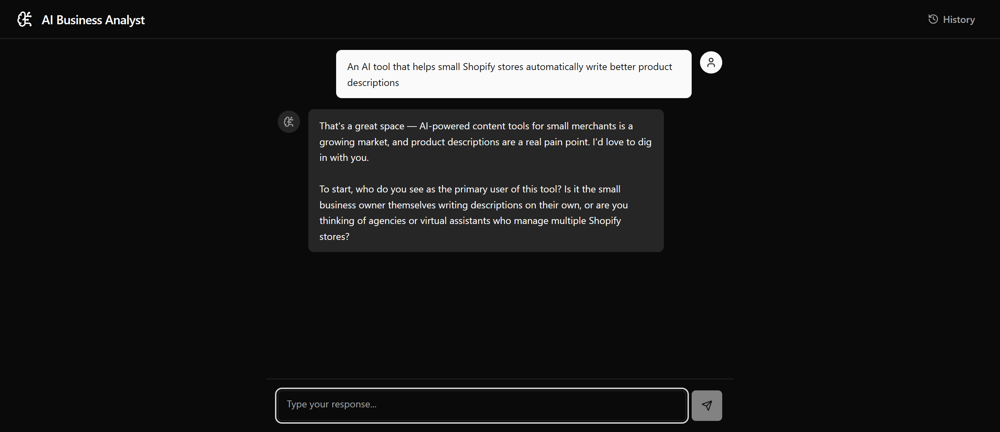
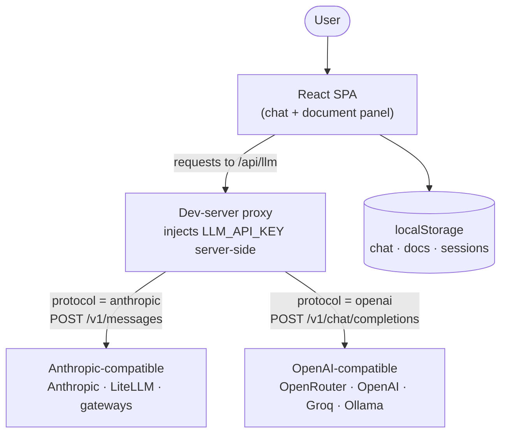
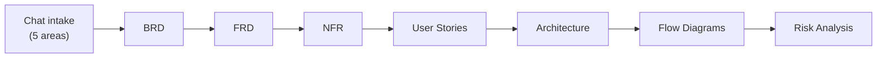

# AI Business Analyst

> An AI agent that interviews you about your product idea, then generates a complete suite of professional business-analysis documents — BRD, FRD, NFRs, user stories, architecture + ER diagrams, flow diagrams, and a risk/roadmap analysis. With live diagram rendering, chat-based editing, and one-click PDF export.



## Why

Turning a fuzzy product idea into proper specs normally takes a senior business analyst days. This tool runs the intake interview and the documentation the way a real BA would — **each document builds on the previous one** (the FRD reads the BRD, the architecture reads the user stories, and so on), so the output is coherent, not seven disconnected blobs.

It's a single-page app with no backend and no database. **Bring your own LLM** — it's plug-and-play with any major provider.

## Plug-and-play with any LLM

Set three env vars and go. Works with **both** the Anthropic Messages API and the OpenAI Chat Completions API, so essentially every provider is supported:

| Provider | `LLM_BASE_URL` | `VITE_LLM_PROTOCOL` |
|----------|----------------|---------------------|
| Anthropic | `https://api.anthropic.com` | `anthropic` |
| OpenRouter | `https://openrouter.ai/api/v1` | `openai` |
| OpenAI | `https://api.openai.com/v1` | `openai` |
| Groq | `https://api.groq.com/openai/v1` | `openai` |
| Together | `https://api.together.xyz/v1` | `openai` |
| Ollama (local, free) | `http://localhost:11434/v1` | `openai` |
| Any compatible gateway (LiteLLM, etc.) | your URL | `anthropic` or `openai` |

## Architecture



- **The app never sees your API key.** The browser only ever calls `/api/llm` on `localhost`. The dev-server proxy attaches your key server-side and forwards to your chosen endpoint.
- **One unified LLM layer** (`src/lib/llm.ts`) abstracts both protocols behind a single `streamLLM()` call, selected by `VITE_LLM_PROTOCOL`.
- **No backend, no database** — all state (chat, generated docs, saved sessions) lives in `localStorage`.

### Generation pipeline (each step reads the previous outputs)



## What it generates

| # | Document | Contents |
|---|----------|----------|
| 1 | **BRD** | Executive summary, objectives, stakeholder map, scope, KPIs |
| 2 | **FRD** | Feature modules, I/O specs, validation, business logic, API contracts |
| 3 | **NFR** | Performance, security, scalability, availability, compliance, accessibility |
| 4 | **User Stories** | Epics with stories, acceptance criteria, MoSCoW priority, story points |
| 5 | **Architecture** | Tech-stack justifications, architecture diagram, DB schema (Mermaid) |
| 6 | **Flow Diagrams** | User journey, API sequence, data flow (Mermaid) |
| 7 | **Risk Analysis** | Risk matrix, MVP scope, effort estimates, roadmap, dependencies |

## Use it as a Claude skill (no app needed)

The whole business-analyst workflow is also packaged as a portable **agent skill** in [`skills/business-analyst/`](skills/business-analyst), so you can run it directly inside Claude Code / Claude — no web app required.

**Download just the skill** straight into your skills folder:

```bash
npx degit Anik2901/ai-business-analyst/skills/business-analyst ~/.claude/skills/business-analyst
```

Or copy it from a clone: `cp -r skills/business-analyst ~/.claude/skills/`

Then just describe a product idea — the skill runs the 5-area intake and produces the full document suite, following the exact structure in [`references/document-structures.md`](skills/business-analyst/references/document-structures.md).

## Features

- 🗣️ Conversational intake — one question at a time, streamed responses
- 🔗 Chained generation — each doc generated with the previous docs as context
- 📊 Live Mermaid diagrams in a zoom/pan canvas (scroll to zoom, drag to pan)
- ✏️ Surgical edits via chat — "tighten the stakeholder map" touches only that section
- 🔁 Smart regeneration — redo any step and downstream docs rebuild automatically
- 💾 Session history — every run saved locally and reloadable
- 📄 PDF export — single doc or the full suite
- 🔌 Plug-and-play LLM — any Anthropic- or OpenAI-compatible provider

## Quick start

```bash
git clone https://github.com/Anik2901/ai-business-analyst.git
cd ai-business-analyst
npm install

cp .env.example .env
# edit .env — set your provider (see table above)

npm run dev      # open http://localhost:5173
```

### Configuration (`.env`)

```ini
LLM_API_KEY=your-key-here                 # your provider's API key
LLM_BASE_URL=https://openrouter.ai/api/v1 # endpoint base URL (see table)
VITE_LLM_PROTOCOL=openai                  # "anthropic" or "openai"
VITE_MODEL=anthropic/claude-3.5-sonnet    # a model your endpoint supports
```

> Run with `npm run dev`. The key-injecting proxy is part of the dev server, so your key stays on your machine and never reaches the browser. See [SETUP.md](SETUP.md) and [docs/LOCAL_MODELS.md](docs/LOCAL_MODELS.md) for details and local/offline use.

## How it works

```
Chat intake  →  [READY_TO_GENERATE]  →  7-step chained pipeline  →  tabs (Markdown + Mermaid)  →  edit via chat  →  PDF
  useChat            trigger                 useGenerate                 DocumentPanel              editDocument    ExportBar
```

- **Intake** (`src/hooks/useChat.ts`, `src/prompts/system.ts`) — a senior-BA system prompt runs a 5-area interview and signals readiness.
- **Pipeline** (`src/hooks/useGenerate.ts`) — runs steps 1→7; each step's prompt receives the chat context plus earlier outputs. Responses stream and are parsed with a fault-tolerant JSON parser that repairs truncated model output. Each generation is tagged to its conversation, so a new topic never shows stale docs.
- **LLM layer** (`src/lib/llm.ts`) — one `streamLLM()` that speaks Anthropic or OpenAI based on config.
- **Rendering** (`src/components/DocumentTab.tsx`, `MermaidDiagram.tsx`) — Markdown via `react-markdown`, diagrams via Mermaid in a zoom/pan canvas.

## Tech stack

React 18 · TypeScript · Vite · Tailwind CSS · shadcn/ui · Mermaid · react-markdown · react-zoom-pan-pinch · html2pdf.js

## Roadmap

- [ ] Upload your own notes/brief to pre-fill the intake
- [ ] Live "what's left" intake checklist
- [ ] Export to Markdown / DOCX / Notion
- [ ] Editable diagrams

## License

MIT © Aniket Bhatt — see [LICENSE](LICENSE).
