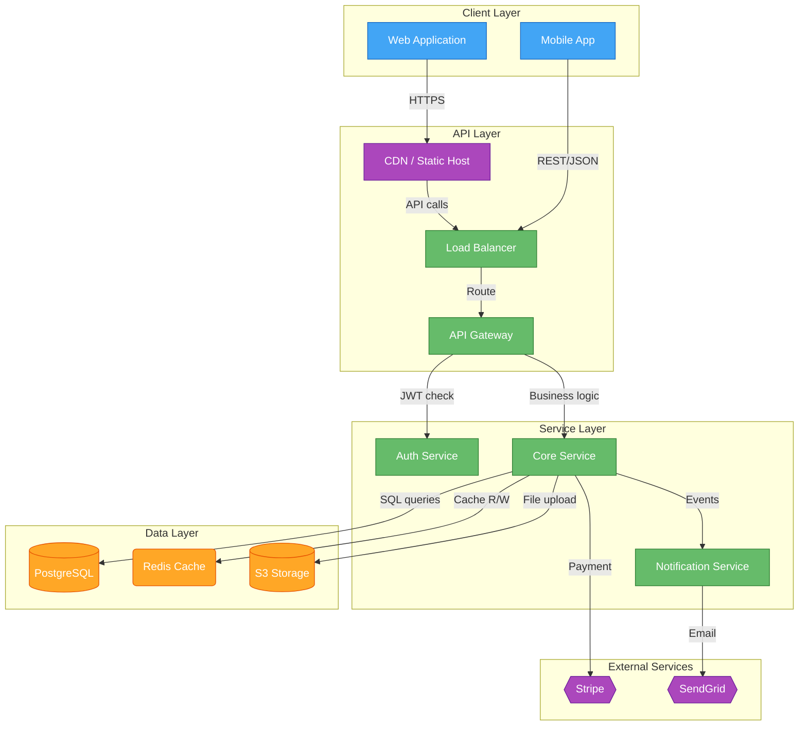
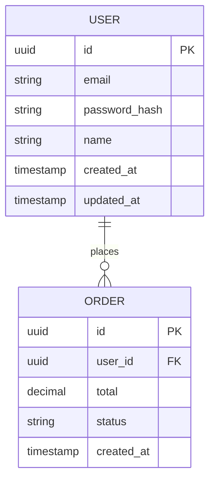
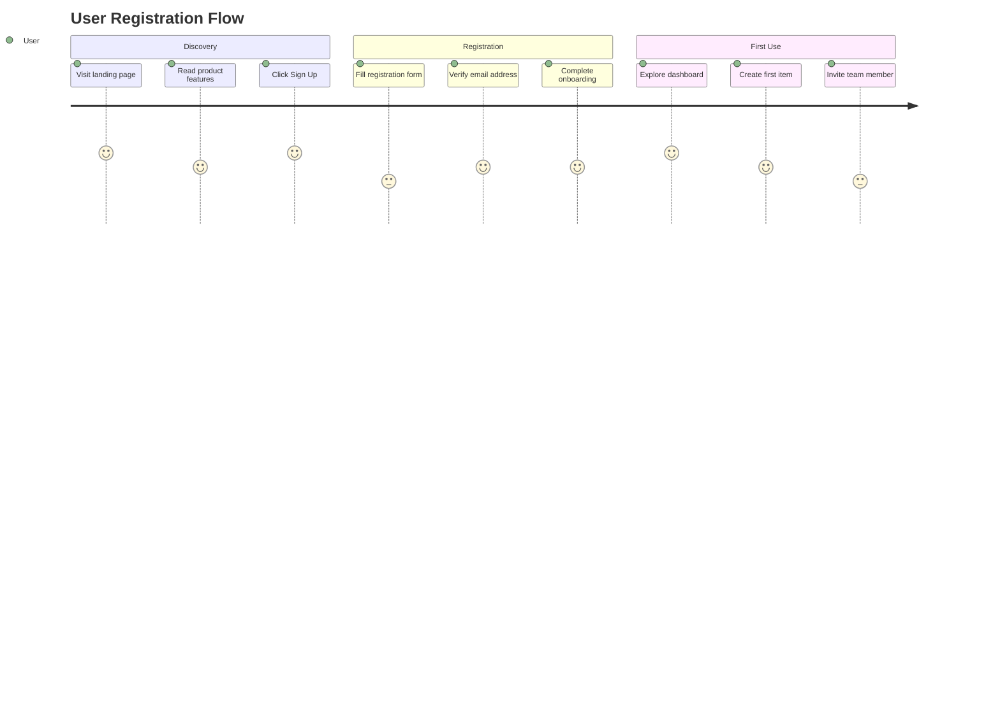
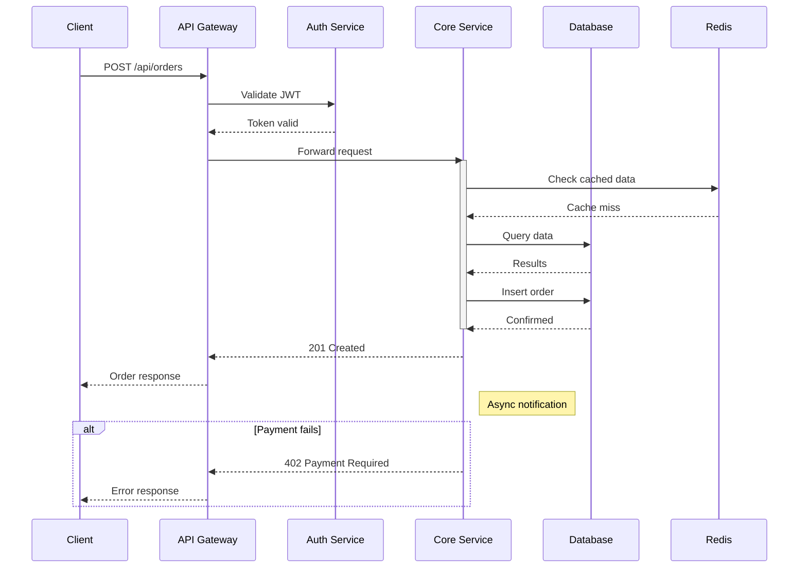
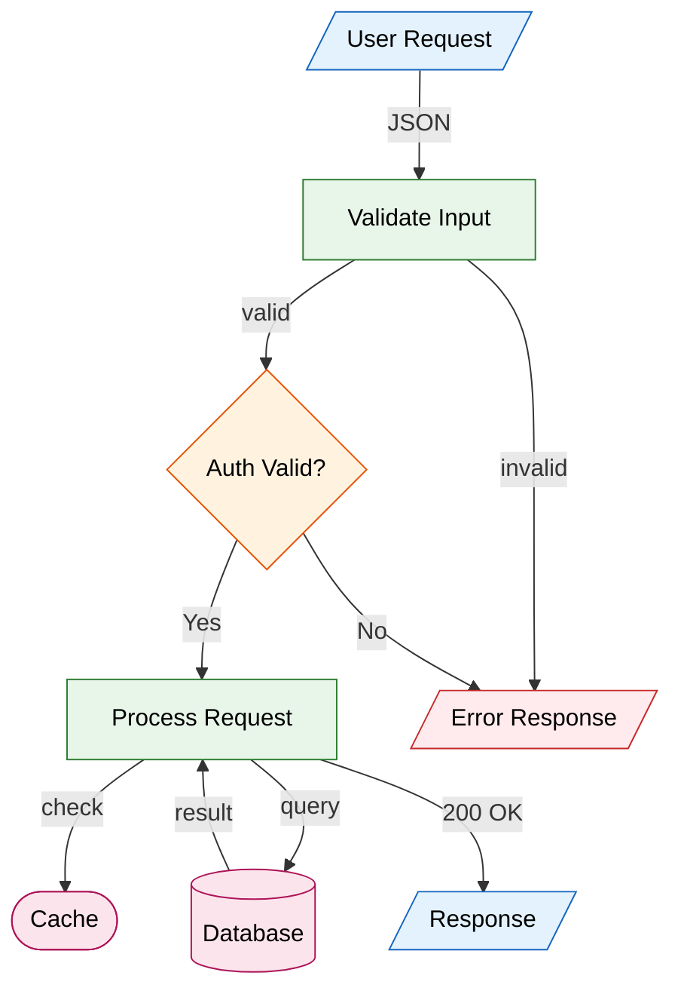

# Mermaid Diagram Rules

Five diagrams across the Architecture and Flow-Diagram documents. Keep every diagram **valid** and **specific to the product** (never a generic template). Node IDs must be consistent (define `auth_svc`, reference `auth_svc`). Every `subgraph` closes with `end`. Quote edge labels containing spaces. Prefer a smaller correct diagram over a large broken one.

---

## Architecture Diagram — `graph TD`

- **5 subgraphs:** `Client Layer`, `API Layer`, `Service Layer`, `Data Layer`, `External Services`.
- **≥ 12 nodes**, snake_case IDs. Shapes: `[Service]` rectangle · `[(Database)]` cylinder · `{{External}}` hexagon · `(Cache)` rounded.
- **Every edge labeled** with the interaction (`-->|"REST/JSON"|`, `-->|"JWT validation"|`, `-->|"SQL queries"|`).
- Include: CDN/static host, load balancer/API gateway, auth service, ≥ 2 product-specific business services, primary DB, cache, file/object storage (if relevant), ≥ 2 external integrations, message queue/event bus (if relevant).
- **classDef** at the end and apply with `class`:
  - `classDef frontend fill:#42A5F5,stroke:#1565C0,color:#fff`
  - `classDef backend fill:#66BB6A,stroke:#2E7D32,color:#fff`
  - `classDef database fill:#FFA726,stroke:#E65100,color:#fff`
  - `classDef external fill:#AB47BC,stroke:#6A1B9A,color:#fff`

## Database Schema — `erDiagram`

- **≥ 6 entities**, UPPER_CASE singular names. Each: `id` PK, `created_at`/`updated_at` timestamps, 3–8 domain fields. Types: string, int, uuid, timestamp, boolean, text, decimal, jsonb.
- **Relationships with cardinality + a label:** `||--o{` one-to-zero-or-many · `||--|{` one-to-one-or-many · `}o--o{` many-to-many · `||--||` one-to-one. e.g. `USER ||--o{ ORDER : "places"`.
- Include: a User/Account entity with auth fields, ≥ 2 core domain entities, a junction table if any M:N exists, an audit/activity-log entity, a config/settings entity.

## User Journey — `journey`

- `title` + **≥ 4 product-specific sections** (e.g. Discovery, Registration, First Use — not "Phase 1").
- **4–6 tasks per section**, format `Task: score: Actor` (score 1–5). **≥ 16 tasks total.** Scores must vary realistically; **≥ 2 tasks score 2–3** to show real pain points. Actor = the primary persona.
- Tells a real arc: initial excitement → setup friction → core-use satisfaction → drop-off points.

## API Sequence — `sequenceDiagram`

- **≥ 6 participants** with descriptive names (Client, API Gateway, Auth, [product service], DB, Cache, External) — names must match the architecture diagram.
- Show the PRIMARY use case end-to-end: auth check → validation → business logic → persistence → response, plus cache interactions.
- Use `activate`/`deactivate`, **≥ 3 `Note right of`** annotations, **≥ 1 `alt`** error block, **≥ 1 `opt`** block, dashed `-->>` returns. **≥ 20 messages.** Show auth-fail / validation-fail / DB-unavailable handling.

## Data Flow — `flowchart TD` (top-down, reads like a real flow)

- **≥ 10 nodes**, descriptive IDs. Shapes: `[/Input/]` parallelogram · `[Process]` rectangle · `{Decision}` diamond · `[(Database)]` cylinder · `[[Queue]]` subroutine · `([Cache])` stadium.
- **Label every edge** with the data/action (`-->|"JSON payload"|`). **≥ 2 decision nodes.** Show the full lifecycle: entry → validation → auth → business logic → persistence → cache → response, plus ≥ 1 error/retry path.
- Same `classDef` styling (input/process/decision/storage/error) applied with `class`.

